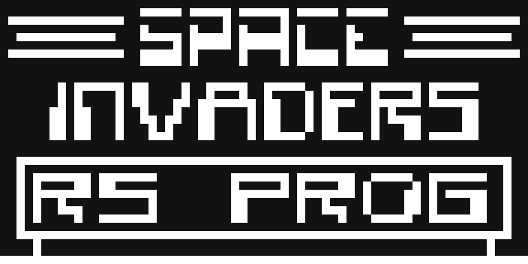
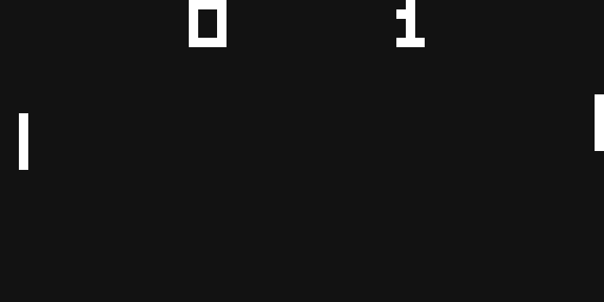
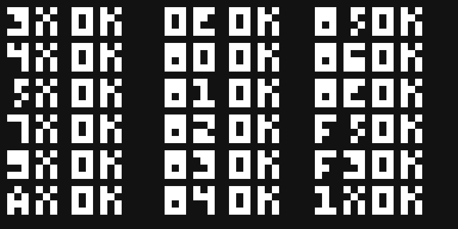

# Emulador CHIP-8

Interpretador de CHIP-8 escrito do zero em **C11 + SDL2**. Implementa as 35
instruções da especificação e roda os jogos clássicos (PONG, TETRIS, Space
Invaders). O core é independente de SDL e validado por ROMs de teste públicas.



| PONG | TETRIS |
|------|--------|
|  |  |

---

## O que é o CHIP-8

CHIP-8 não é um chip: é uma **máquina virtual** criada por Joseph Weisbecker
em 1977 para os microcomputadores COSMAC VIP e Telmac 1800. Em vez de programar
o processador RCA 1802 diretamente, escrevia-se para um conjunto de instruções
sintético de 16 bits, interpretado em software. Era, na prática, um "runtime de
jogos" portátil — a mesma ideia de uma JVM, 20 anos antes.

O modelo de máquina é minúsculo:

| Recurso | Descrição |
|---|---|
| **Memória** | 4 KB (`0x000`–`0xFFF`). Programa carregado a partir de `0x200` (os 512 bytes iniciais eram o próprio interpretador no hardware original). |
| **Registradores** | 16 de 8 bits (`V0`–`VF`). `VF` é reaproveitado como flag de carry/borrow/colisão. |
| **Índice `I`** | 1 registrador de 16 bits (12 bits úteis), base dos acessos à memória. |
| **Pilha** | 16 níveis de 16 bits, só para endereço de retorno de sub-rotina. |
| **Timers** | `delay` e `sound`, ambos decrementando a 60 Hz. `sound > 0` = bipe. |
| **Display** | 64×32 monocromático. Sprites desenhados por **XOR**. |
| **Teclado** | 16 teclas hexadecimais (`0`–`F`). |

Todo opcode tem 16 bits, big-endian. Não há interrupções, MMU, nem I/O além de
tela/teclado/som. É por isso que é o "hello world" da emulação.

---

## Arquitetura do emulador

```
                 ┌───────────────────────────┐
   ROM  ───────► │        core (chip8.c)     │   sem nenhuma dependência
                 │  memória, V[], I, pilha,  │   de SDL — testável isolado
                 │  timers, fetch/decode/exec│
                 └─────────┬────────┬────────┘
                  display[]│        │keypad[]
                 ┌─────────▼──┐  ┌──▼──────────┐
                 │ display.c  │  │  input.c    │
                 │ (SDL render)│  │ (SDL events)│
                 └─────────┬──┘  └──┬──────────┘
                           │        │
                        ┌──▼────────▼──┐
                        │   main.c     │  loop a 60 Hz
                        └──────────────┘
```

| Arquivo | Responsabilidade |
|---|---|
| [`src/chip8.h`](src/chip8.h) / [`src/chip8.c`](src/chip8.c) | **Core.** Um `struct chip8_t` guarda todo o estado da máquina. Expõe 4 funções: `init`, `load_rom`, `cycle` (um fetch-decode-execute), `tick_timers`. Nada de SDL, `stdio` só para logar opcode inválido. |
| [`src/display.c`](src/display.c) | Cria a janela SDL e uma textura 64×32 `ARGB8888`. `display_render` copia `chip8.display[]` (1 byte/pixel) para a textura. Toda a SDL de vídeo está aqui. |
| [`src/input.c`](src/input.c) | Traduz `SDL_Scancode` (posição física da tecla) → tecla hex `0x0`–`0xF` e escreve em `chip8.keypad[]`. Detecta pedido de saída. |
| [`src/main.c`](src/main.c) | Loop principal: input → CPU → timers → render → throttle. |
| [`tests/run_rom.c`](tests/run_rom.c) | Runner headless: roda uma ROM por N ciclos e imprime o framebuffer como ASCII. Linka só contra o core. |

**Por que separar o core da SDL?** O `chip8_t` só conhece dois "periféricos":
o array `display[64*32]` e o array `keypad[16]`. Isso permite exercitar os 35
opcodes sem abrir janela nenhuma — que é exatamente o que o `run_rom` faz com
as ROMs de teste. Trocar SDL por outra biblioteca não toca uma linha do core.

---

## Fetch-decode-execute

O ciclo inteiro está em [`chip8_cycle()`](src/chip8.c). É um interpretador
clássico: nada é traduzido para código nativo, cada instrução é lida, os campos
são extraídos por máscara/shift e um `switch` chama o código C que muta o
`struct`.

### Fetch

```c
c->opcode = (uint16_t)(c->memory[c->pc] << 8 | c->memory[c->pc + 1]);
c->pc += 2;
```

Duas regras que valem para o emulador inteiro:

1. **`pc` sempre aponta para uma instrução** e avança de 2 em 2.
2. O incremento acontece **antes** de executar. Instruções normais caem na
   próxima automaticamente; saltos (`1NNN`, `2NNN`, `BNNN`) simplesmente
   sobrescrevem `pc`. Isso mantém uma regra única de avanço em vez de espalhar
   `pc += 2` por dezenas de `case`.

### Decode

Todo opcode de 16 bits se decompõe nos mesmos campos (nibble = 4 bits):

```
opcode = 0xWXYZ
         │ │ │ └── N    nibble baixo            (opcode & 0x000F)
         │ │ └──── Y    reg. secundário         (opcode & 0x00F0) >> 4
         │ └────── X    reg. primário           (opcode & 0x0F00) >> 8
         └──────── família da instrução         (opcode & 0xF000)

NN  = opcode & 0x00FF     constante de 8 bits
NNN = opcode & 0x0FFF     endereço de 12 bits
```

```c
uint16_t nnn = c->opcode & 0x0FFF;
uint8_t  nn  = (uint8_t)(c->opcode & 0x00FF);
uint8_t  n   = (uint8_t)(c->opcode & 0x000F);
uint8_t  x   = (uint8_t)((c->opcode & 0x0F00) >> 8);
uint8_t  y   = (uint8_t)((c->opcode & 0x00F0) >> 4);
```

O dispatch é em dois níveis. O `switch (opcode & 0xF000)` resolve a maioria das
instruções direto. Quatro famílias compartilham o nibble alto e precisam de um
segundo `switch`:

| Família | Discriminador do 2º nível | Instruções |
|---|---|---|
| `0x0` | byte baixo (`& 0x00FF`) | `00E0` (CLS), `00EE` (RET) |
| `0x8` | **nibble** baixo (`& 0x000F`) | ULA: `8XY0`–`8XYE` |
| `0xE` | byte baixo | `EX9E`, `EXA1` (teclado) |
| `0xF` | byte baixo | timers, BCD, fonte, load/store |

Cada `case` está comentado no fonte com a semântica e o quirk relevante.

---

## Decisões de implementação (os quirks)

O CHIP-8 tem várias ambiguidades entre a implementação original (COSMAC VIP,
1977), o CHIP-48 da HP-48 (1990) e o SUPER-CHIP (1991). As escolhas aqui
priorizam **rodar os jogos clássicos**.

### 1. `VF` calculado por último (`8XY4`, `8XY5`, `8XY7`)

Se `x == 0xF`, escrever o resultado em `Vx` e a flag em `VF` disputam a mesma
posição — e o operando é necessário para calcular a flag. A flag vai para uma
variável local, `Vx` é escrito, e só então `V[0xF]`. O valor final de `VF` é
sempre a flag, que é o comportamento testado pelas ROMs de conformidade.

### 2. Semântica do borrow é invertida

Em `8XY5`/`8XY7`, `VF = 1` significa **"não houve empréstimo"** (`Vx >= Vy`).
`VF = 0` é que indica underflow. Para o carry de `8XY4` é o intuitivo:
`VF = 1` quando estoura 255.

### 3. Shift desloca `Vx` no lugar (`8XY6`, `8XYE`)

O CHIP-8 original fazia `Vx = Vy >> 1`. CHIP-48/SCHIP ignoram `Vy` e deslocam
o próprio `Vx`. PONG, TETRIS e INVADERS assumem o comportamento novo → é o
adotado.

### 4. `7XNN` não afeta `VF`

Só o add registrador-registrador (`8XY4`) seta carry. Implementar `VF` no add
imediato quebra ROMs que usam `V[0xF]` como registrador comum logo em seguida.

### 5. `FX55`/`FX65` avançam `I`

O interpretador original deixava `I = I + X + 1` ao final do load/store. SCHIP
deixa `I` intacto. Os jogos-alvo são da era original → `I` é avançado. A
escolha fica atrás de `#define CHIP8_QUIRK_LOADSTORE_INC_I` no topo de
[`chip8.c`](src/chip8.c) (troque para `0` = comportamento SCHIP).

### 6. `DXYN`: wrap na origem, clip no transbordo

A coordenada inicial faz wrap (`Vx % 64`, `Vy % 32`). Mas um sprite que
*começa* dentro da tela e ultrapassa a borda direita/inferior é **clipado** —
não reaparece do outro lado.

### 7. `FX0A` como polling

Esperar tecla sem travar o loop: se nenhuma tecla está pressionada, recua
`pc -= 2` e a instrução se re-executa no ciclo seguinte.

### 8. Temporização: 540 Hz de CPU, 60 Hz de timers

A spec fixa os timers em 60 Hz mas não a velocidade da CPU. O loop roda a
60 Hz e, por frame, executa **9 instruções** (`540 / 60`) e dá **1 tick** nos
timers. `CYCLES_PER_FRAME` em [`main.c`](src/main.c) ajusta a "clock".

### 9. Lógicas não mexem em `VF` (`8XY1/2/3`)

O COSMAC VIP zerava `VF` após OR/AND/XOR. Comportamento moderno (e dos
jogos-alvo): não tocar em `VF`.

---

## Build

Requer um compilador C11 e **SDL2**.

```bash
# Linux (Debian/Ubuntu)
sudo apt install build-essential libsdl2-dev

# macOS
brew install sdl2

# Windows (MSYS2 / UCRT64)
pacman -S mingw-w64-ucrt-x86_64-gcc mingw-w64-ucrt-x86_64-SDL2
```

```bash
make               # -> build/chip8
make tests         # -> build/run_rom  (headless, não precisa de SDL)
```

## Uso

```bash
./build/chip8 roms/games/PONG.ch8
# ou
make run ROM=roms/games/INVADERS.ch8
```

### Controles

O teclado hexadecimal do CHIP-8 é mapeado para o lado esquerdo do teclado:

```
   CHIP-8            Físico (QWERTY)
  1 2 3 C             1 2 3 4
  4 5 6 D             Q W E R
  7 8 9 E             A S D F
  A 0 B F             Z X C V
```

`ESC` fecha o emulador. Cada ROM define suas próprias teclas internamente
(não há um padrão fixo) — a tabela acima é o mapeamento físico↔hex; dentro
dele, PONG usa tipicamente `1`/`Q` (ou `4`/`R`) para mover a raquete, e
TETRIS/INVADERS usam `Q`/`E` para os lados e `W`/`A` para girar/atirar. Teste
as teclas próximas dessa região se um jogo não responder de primeira.

---

## Testes

O core é validado por ROMs de teste públicas rodadas no runner headless:

```bash
make check   # roda todas as roms/tests/*.ch8 e imprime o framebuffer
```

| ROM de teste | Cobertura | Resultado |
|---|---|---|
| [`corax89/test_opcode`](https://github.com/corax89/chip8-test-rom) | os 35 opcodes | **100%** (todos os grupos → `OK`) |
| [Timendus `3-corax+`](https://github.com/Timendus/chip8-test-suite) | opcodes + casos de borda | **100%** (grid inteiro → ✓) |
| Timendus `4-flags` | carry / borrow / `VF` em detalhe | **100%** |
| Timendus `2-ibm-logo` | fetch + `DXYN` | renderiza limpo |



*(As ROMs em `roms/` não são versionadas — veja `.gitignore`. Todas são de
domínio público e fáceis de encontrar nos repositórios linkados acima.)*

---

## Estrutura do repositório

```
.
├── src/
│   ├── chip8.h / chip8.c     core: estado + fetch-decode-execute
│   ├── display.h / display.c  camada de vídeo (SDL)
│   ├── input.h / input.c      mapeamento de teclado (SDL)
│   └── main.c                 loop principal a 60 Hz
├── tests/
│   └── run_rom.c              runner headless de validação
├── roms/
│   ├── games/                 PONG, TETRIS, INVADERS  (não versionado)
│   └── tests/                 ROMs de conformidade    (não versionado)
├── docs/screenshots/
├── Makefile
└── README.md
```

## Referências

- [Cowgod's Chip-8 Technical Reference](http://devernay.free.fr/hacks/chip8/C8TECH10.HTM)
- [Guide to making a CHIP-8 emulator — Tobias V. Langhoff](https://tobiasvl.github.io/blog/write-a-chip-8-emulator/)
- [Timendus CHIP-8 test suite](https://github.com/Timendus/chip8-test-suite)
- [Mastering CHIP-8 — Matthew Mikolay](https://github.com/mattmikolay/chip-8/wiki/Mastering-CHIP%E2%80%908)
